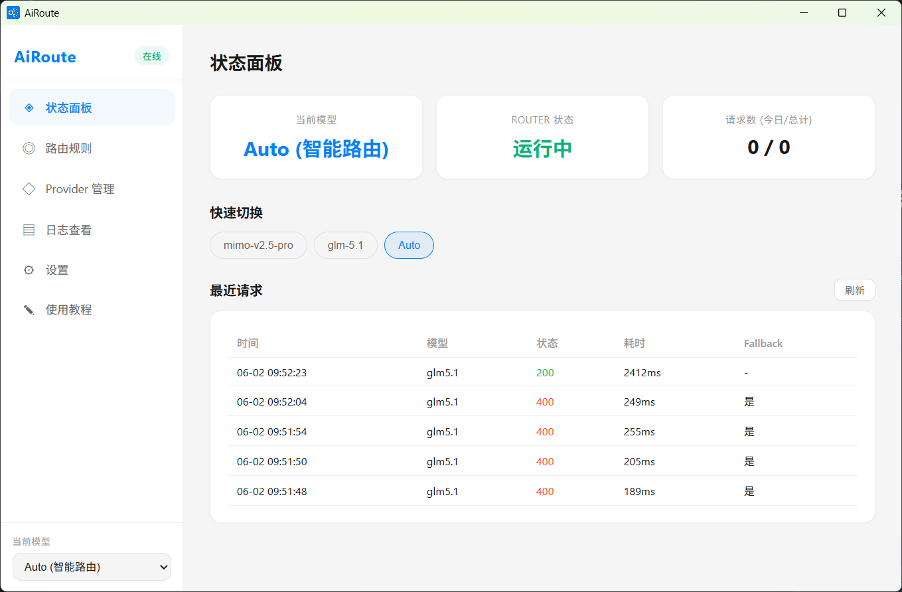
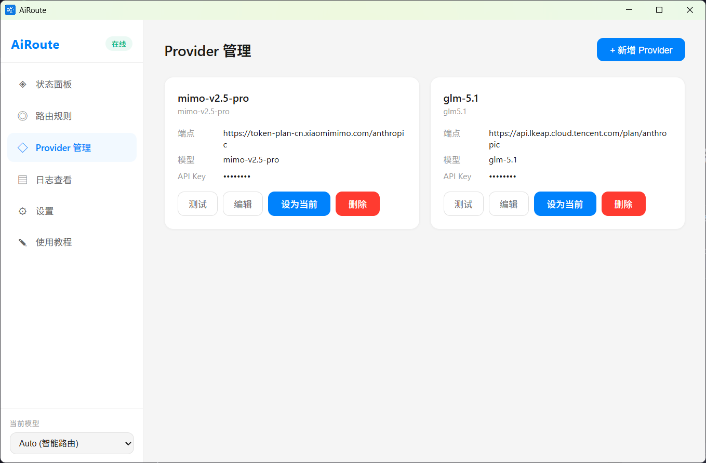
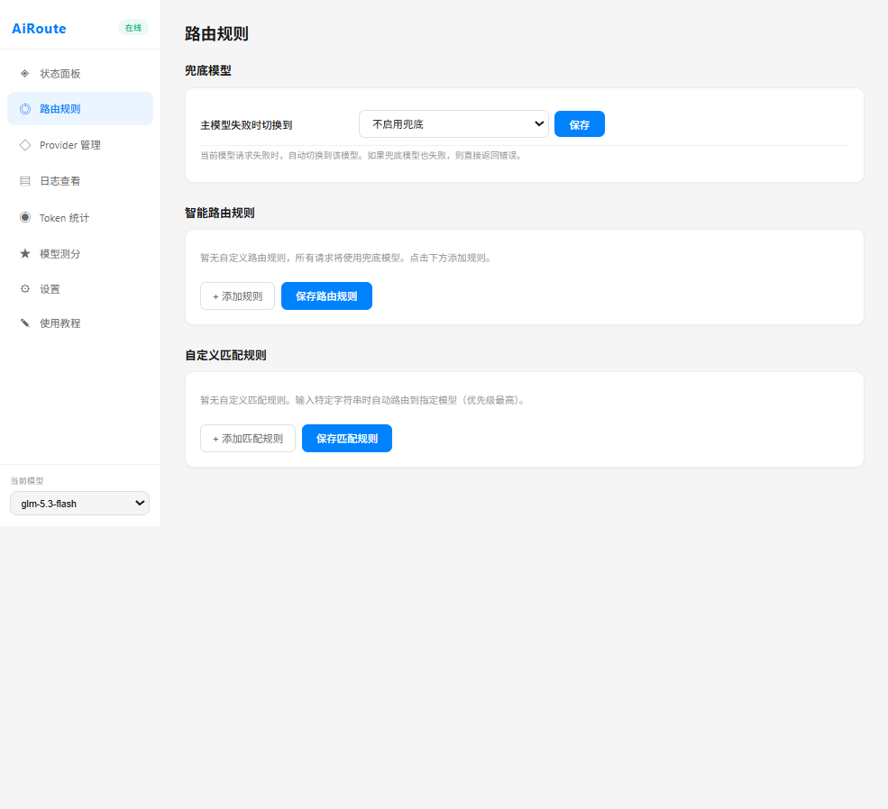

# AiRoute

> 本地 LLM 多模型调度网关 — 好钢用在刀刃上，贵的模型做难事，便宜的做杂事。

[](https://github.com/c347087870/AiRoute)
[](https://nodejs.org)
[](LICENSE)
[](https://pnpm.io)

---

## 界面预览







---

## 为什么选择 AiRoute

- **统一入口** — 所有 AI 客户端只需连接 `http://localhost:3000`，不再关心真实 API 地址
- **一键切换模型** — Electron 客户端面板点击切换，无需修改任何客户端配置
- **智能路由** — 中文走国产模型、代码走 Claude、自定义关键词匹配，按任务选最优
- **双协议支持** — 每个 Provider 可分别配置 Anthropic 和 OpenAI 端点，请求直接走对应协议，不做格式转换
- **故障自愈** — 主模型挂了自动 fallback，对客户端完全透明
- **可视化操作** — Electron 桌面应用，所有配置（Provider、规则、Fallback）均在界面完成
- **开箱即用** — 打包后为单个 exe 文件，内置 Express 服务无需额外安装部署，双击即用

---

## 架构

```
┌──────────────────────────────────────────┐
│          Claude Code / 任意 AI 客户端       │
│         ANTHROPIC_BASE_URL=localhost:3000 │
└──────────────────┬───────────────────────┘
                   │
                   ▼
┌──────────────────────────────────────────┐
│            AiRoute Router (:3000)          │
│  请求代理 · 模型切换 · 智能路由 · Fallback   │
└──────┬──────────┬──────────┬─────────────┘
       │          │          │
       ▼          ▼          ▼
   ┌──────┐  ┌──────┐  ┌──────┐
   │ GLM  │  │ 小米 │  │Claude│  ···
   └──────┘  └──────┘  └──────┘
```

---

## 功能

### 请求代理（核心）

- 同时兼容 **Anthropic Messages API** (`/v1/messages`) 和 **OpenAI Chat Completions API** (`/v1/chat/completions`)
- 自动替换 model、headers、endpoint，转发到当前激活的 Provider
- 支持流式（SSE）和非流式两种响应模式

### 模型切换

在 Electron 客户端的 Dashboard 页面点击模型芯片即可实时切换，或通过系统托盘右键菜单（按 Provider 分组的二级菜单）快速切换。Providers 页面每个模型行也有独立的「切换」按钮。侧边栏下拉框、状态面板、托盘菜单、Providers 页面四处同步。

### Provider 管理

在客户端的 Providers 页面可视化增删改查 Provider，支持连通性测试。API Key 支持密码/明文切换和复制。

**一个 Provider 可以配置多个模型，每个模型可单独设置最大上下文与最大输出：**

```json
{
  "my-provider": {
    "baseURL": "https://your-api.com/anthropic",
    "openaiURL": "https://your-api.com/v1",
    "apiKey": "your-api-key",
    "displayName": "我的 Provider",
    "models": [
      { "id": "model-large", "displayName": "大杯", "maxContext": 200000, "maxOutput": 8192 },
      { "id": "model-small", "displayName": "小杯" }
    ]
  }
}
```

> - `baseURL` 用于 Anthropic 协议（`/v1/messages`），`openaiURL` 用于 OpenAI 协议（`/v1/chat/completions`），二者至少填一个。
> - `maxContext` / `maxOutput` **不填就是空**。`maxOutput` 会在请求未指定 `max_tokens` 时自动注入（Anthropic 协议要求该字段必填）。
> - 数组第一个模型是该 Provider 的默认模型。
> - 老配置里的单个 `"model": "xxx"` 字段会被自动识别为该 Provider 的唯一模型，**不会改写你的配置文件**。

### 模型引用

切换与路由的最小单位是**模型**，引用格式为 `Provider名/模型ID`：

```
my-provider/model-large     my-provider/model-small     auto
```

侧边栏下拉、状态面板快速切换、托盘菜单、路由规则目标、兜底模型，全部使用这个格式。老配置里只写了 Provider 名（如 `my-provider`）也能正常工作，解析时取其默认模型。

### Fallback 机制

主模型请求失败时，自动切换到备用模型。Fallback 配置在「路由规则」页面完成。

### 智能路由（auto 模式）

当激活模型设为 `auto` 时，根据请求内容自动选择最优模型。支持 13 种内置检测条件（代码、SQL、中文、翻译、代码审查等）+ 自定义关键词匹配。

> **自定义规则**：只匹配本次输入的最后一条用户消息，不受对话历史影响。如配置关键词 `123` → A 模型、`456` → B 模型，输入包含 `123` 就走 A 模型，与上下文无关。

路由规则在「路由规则」页面可视化编辑，所有 fallback 事件记录日志可追溯。

### 日志系统

- 记录：时间戳、模型、响应时间、状态码、输入/输出/缓存读/缓存写 Token、fallback 信息
- 脱敏处理：API Key 相关字段自动隐藏
- 按天分文件存储（`logs/usage-YYYY-MM-DD.log`），在客户端「日志」页面可一键清空
- 在客户端「日志」页面按模型/状态筛选、关键词搜索、导出 CSV、清空

### Token 统计

统计口径按四个维度分开记录，**缓存单独计数，不与输入重复计算**：

| 字段 | 含义 |
|---|---|
| `input` | 未命中缓存的输入 Token |
| `cacheRead` | 从缓存读取的输入 Token |
| `cacheWrite` | 写入缓存的输入 Token |
| `output` | 输出 Token |
| `total` | `input + cacheRead + cacheWrite + output` |

- Anthropic：`input_tokens` 本身不含缓存部分，直接取 `cache_read_input_tokens` / `cache_creation_input_tokens`
- OpenAI：`prompt_tokens` **包含**缓存部分，统计时从 `prompt_tokens_details.cached_tokens` 扣除后计入 `input`
- 所有时间维度（今日/本月/按小时）均使用**本机本地时间**
- 数据保留 35 天，按天清理

### 模型测分

内置题库跑一遍多个模型，出横向对比排行榜与各维度得分。

- **内置题库**：40 道题，覆盖代码生成、代码修复、SQL、数学计算、逻辑推理、翻译、指令遵循、结构化输出、长上下文九个维度，满分 200 分
- **两种评分方式**
  - 客观题用规则判定：`exact`（完全相等）、`contains`（按关键词命中比例）、`regex`（正则命中即满分）、`json`（按 schema 校验字段与类型）
  - 主观题（翻译、开放问答）交给**裁判模型**按评分细则打 1-5 分，裁判模型可以任选一个已配置的模型
- **题库可自行编辑**：增删改题目、按分类筛选、导入/导出 JSON、一键恢复内置题库
- **评测维度**：总分与得分率、各分类得分率、成功/失败数、平均延迟、Token 消耗
- 评测**直连 Provider**，不经过智能路由与 fallback，确保测的是目标模型本身

### Electron 可视化客户端

| 页面 | 功能 |
|---|---|
| Dashboard | 当前模型、请求数统计、Token 用量（含缓存）、最近日志 |
| Providers | 增删改 Provider 与模型、连通性测试、单模型切换 |
| 路由规则 | 智能路由规则编辑、fallback 配置 |
| 日志 | 筛选/搜索、导出 CSV、清空 |
| Token 统计 | 用量趋势图、各模型用量占比 |
| 模型测分 | 多模型跑分对比、题库编辑与导入导出 |
| 设置 | 端口配置、服务重启、开机自启 |
| 使用教程 | 接入说明、功能概览 |

系统托盘驻留：右键快速切换模型、打开面板。

---

## 快速开始

### 前置条件

- [Node.js](https://nodejs.org) >= 18
- [pnpm](https://pnpm.io) >= 10

### 安装

```bash
# 克隆项目
git clone https://github.com/c347087870/AiRoute.git
cd aiRoute

# 安装依赖（全部依赖集中在根 package.json，一次安装）
pnpm install
```

### 配置 Provider

```bash
# 复制配置模板
cp server/models.example.json server/models.json

# 编辑 models.json，填入你的 API 信息
```

编辑 `server/models.json`：

```json
{
  "my-model": {
    "baseURL": "https://your-api-endpoint.com/anthropic",
    "openaiURL": "https://your-api-endpoint.com/v1",
    "apiKey": "your-api-key",
    "displayName": "我的 Provider",
    "models": [
      { "id": "your-model-id", "displayName": "主力", "maxContext": 200000, "maxOutput": 8192 },
      { "id": "your-fast-id", "displayName": "轻量" }
    ]
  }
}
```

> Provider 名称不能包含斜杠 `/` 或空格。

> **注意**：`models.json` 包含 API Key，已加入 `.gitignore`，不会被提交到仓库。也可通过 Electron 客户端的 Providers 页面配置。

### 启动

```bash
# Electron 桌面应用（服务 + Vite + Electron 窗口）
pnpm dev

# 仅启动服务（配合任意客户端使用）
node server/router.js
```

服务默认运行在 `http://localhost:3000`。启动后打开 Electron 客户端即可管理所有配置。

---

## 接入 Claude Code

> **⚠️ 关键**：`ANTHROPIC_BASE_URL` 只需写到端口号，**不要**带 `/v1/messages` 路径。Claude Code 会自动拼接 `/v1/models`、`/v1/messages` 等路径。

### 1. 配置文件位置

Claude Code 的配置文件位于用户目录下：

```
~/.claude/settings.json          # macOS / Linux
C:\Users\<用户名>\.claude\settings.json  # Windows
```

### 2. 完整配置

打开配置文件，写入：

```json
{
  "env": {
    "ANTHROPIC_AUTH_TOKEN": "sk-airoute",
    "ANTHROPIC_BASE_URL": "http://localhost:3000"
  },
  "model": "claude-opus-4-7"
}
```

**字段说明：**

| 字段 | 值 | 说明 |
|---|---|---|
| `ANTHROPIC_BASE_URL` | `http://localhost:3000` | **不要带路径**，只写到端口 |
| `ANTHROPIC_AUTH_TOKEN` | `sk-airoute`（任意非空字符串） | AiRoute 不做认证，填任意值即可 |
| `model` | 从下方别名中任选一个 | 实际调用的是 AiRoute 当前激活的 Provider |

### 3. 可选模型别名

`/v1/models` 会返回**你配置的所有真实模型 ID**，外加下列兼容别名，Claude Code 的 `model` 字段可从下列选择：

```
claude-opus-4-0-20250514    claude-opus-4-20250514
claude-sonnet-4-0-20250514  claude-sonnet-4-20250514
claude-3-7-sonnet-20250219  claude-3-5-sonnet-20241022
claude-3-5-haiku-20241022   claude-3-opus-20240229
gpt-4o                      gpt-4o-mini
gpt-4-turbo                 gpt-3.5-turbo
```

> 无论选哪个别名，实际调用的是 AiRoute 当前激活的 Provider。切换 Provider 在 Electron 客户端中完成，无需修改 Claude Code 配置。

### 4. 重启 Claude Code

修改配置后，**完全退出 Claude Code 再重新启动**，配置方可生效。

---

## API 参考

### 核心代理

| 方法 | 路径 | 说明 |
|---|---|---|
| `POST` | `/v1/messages` | Anthropic 协议代理 |
| `POST` | `/v1/chat/completions` | OpenAI 协议代理 |
| `GET` | `/v1/models` | 返回兼容的模型列表（含别名） |

### 模型管理

| 方法 | 路径 | 说明 |
|---|---|---|
| `GET` | `/api/state` | 获取当前激活模型引用 |
| `POST` | `/api/state` | 切换当前模型 `{"current": "my-provider/model-large"}` |

### Provider 管理

| 方法 | 路径 | 说明 |
|---|---|---|
| `GET` | `/api/providers` | 列出所有 Provider（Key 脱敏，`model` 字段已归一化为 `models` 数组） |
| `GET` | `/api/providers/:name/full` | 获取单个 Provider 完整信息 |
| `POST` | `/api/providers/:name` | 新增 Provider（字段白名单，名称不能含 `/` 或空格） |
| `PUT` | `/api/providers/:name` | 更新 Provider（apiKey 为空保留原值，`models` 整体替换） |
| `DELETE` | `/api/providers/:name` | 删除 Provider，并同步清理 state / fallback / 路由规则中的悬空引用 |
| `POST` | `/api/providers/:name/test` | 连通性测试，可选 `{"model": "模型ID"}` 指定模型；**测试用量不计入统计** |

### Fallback

| 方法 | 路径 | 说明 |
|---|---|---|
| `GET` | `/api/fallback` | 获取 fallback 配置 |
| `PUT` | `/api/fallback` | 设置 fallback 模型 `{"model": "my-provider/model-large"}` |

### 路由规则

| 方法 | 路径 | 说明 |
|---|---|---|
| `GET` | `/api/rules` | 获取智能路由规则 |
| `PUT` | `/api/rules` | 更新路由规则（含 customRules） |

> `long_context` 条件按整轮对话字符数判定，超过约 12000 字符（中文约 8k Token 以上）命中。

### 日志与统计

| 方法 | 路径 | 说明 |
|---|---|---|
| `GET` | `/api/logs?limit=50&model=&status=&keyword=` | 获取日志，可按模型 / 状态(`success`/`failed`) / 关键词筛选 |
| `GET` | `/api/logs/models` | 日志中出现过的模型引用列表 |
| `DELETE` | `/api/logs` | 清空全部日志 |
| `GET` | `/api/stats` | 请求数统计，与 Token 统计同源：`{ todayRequests, todayFailed, totalRequests, totalFailed, retentionDays }` |

### Token 统计

| 方法 | 路径 | 说明 |
|---|---|---|
| `GET` | `/api/token-stats` | 获取全部 Token 用量统计 |
| `GET` | `/api/token-stats/today` | 今日 Token 用量 |
| `GET` | `/api/token-stats/month` | 本月 Token 用量统计 |
| `GET` | `/api/token-stats/model/:name` | 指定模型的 Token 用量 |
| `GET` | `/api/token-stats/period/:days` | 指定天数内用量（1-30天） |
| `GET` | `/api/token-stats/hourly/:date` | 某一天按小时统计 |

> 统计对象结构：`{ input, output, cacheRead, cacheWrite, total, count, failed }`，`total = input + cacheRead + cacheWrite + output`。

### 模型测分

| 方法 | 路径 | 说明 |
|---|---|---|
| `GET` | `/api/benchmark/questions` | 获取题库（首次调用从内置题库复制一份到数据目录） |
| `PUT` | `/api/benchmark/questions` | 整体保存题库 |
| `POST` | `/api/benchmark/questions/import` | 导入题库，`{ questions, mode }`，mode 为 `replace`/`append` |
| `POST` | `/api/benchmark/questions/reset` | 恢复内置题库 |
| `POST` | `/api/benchmark/run` | 启动评测 `{ refs, questionIds, judgeRef, concurrency }`，返回 `{ runId, total }` |
| `GET` | `/api/benchmark/status` | 评测进度 `{ running, runId, total, completed }` |
| `GET` | `/api/benchmark/runs` | 历史列表（不含每题回答） |
| `GET` | `/api/benchmark/runs/:id` | 单次详情（含每题回答） |
| `DELETE` | `/api/benchmark/runs/:id` | 删除单条记录 |
| `DELETE` | `/api/benchmark/runs` | 清空全部记录 |

> 题目结构：`{ id, category, title, prompt, maxTokens?, scoring: { mode, maxScore, answer?, keywords?, pattern?, flags?, schema?, rubric? } }`
> `mode` 取值：`exact`（完全相等）、`contains`（按关键词命中比例给分）、`regex`（正则命中即满分）、`json`（按 schema 校验，支持剥离 markdown 代码块）、`llm`（交给裁判模型按 rubric 打分）。

### 系统

| 方法 | 路径 | 说明 |
|---|---|---|
| `GET` | `/api/health` | 健康检查，返回 `{ status, uptime, port }` |
| `GET` | `/api/server-config` | 获取服务配置 |
| `PUT` | `/api/server-config` | 更新服务配置（如端口） |
| `POST` | `/api/restart` | 重启监听（不退出进程，按当前配置重新 listen 端口） |

---

## 项目结构

```
aiRoute/
├── server/                      # Router 核心服务
│   ├── .npmrc                    # pnpm 配置
│   ├── router.js                # 请求代理入口（Express）
│   ├── router-engine.js         # 智能路由引擎
│   ├── models.js                # Provider / 模型引用解析、字段白名单、引用清理
│   ├── benchmark.js             # 模型测分：题库管理、评分器、并发执行引擎
│   ├── upstream.js              # 上游协议封装（端点/请求头/用量提取），router 与 benchmark 共用
│   ├── token-stats.js           # Token 用量统计（含缓存维度）
│   ├── logger.js                # 日志模块（按天分文件、筛选、清空）
│   ├── paths.js                 # 数据目录与端口的统一入口
│   ├── questions.json           # 内置题库（40 题，作为种子只读）
│   ├── models.example.json      # Provider 配置模板
│   ├── models.json              # Provider 配置（gitignore）
│   ├── token-stats.json         # Token 用量数据（gitignore）
│   ├── benchmark-questions.json # 可编辑题库（gitignore，首次运行从内置题库复制）
│   ├── benchmark-runs.json      # 评测记录（gitignore，保留最近 20 次）
│   ├── state.json               # 当前模型状态（存模型引用）
│   ├── fallback.json            # Fallback 配置
│   ├── rules.json               # 智能路由规则
│   ├── server-config.json       # 服务配置（端口等）
│   └── logs/                    # 日志目录（gitignore）
│
├── app/                         # Electron 可视化客户端
│   ├── main/                    # 主进程
│   │   ├── main.js              # 窗口管理 + 生产模式内置启动 Express
│   │   ├── tray.js              # 系统托盘（按 Provider 分组的二级菜单）
│   │   ├── preload.js           # IPC 桥接
│   │   └── icon.ico             # 应用图标
│   └── renderer/                # 渲染进程（Vue 3）
│       ├── src/
│       │   ├── App.vue          # 根组件
│       │   ├── views/           # 8 个页面
│       │   ├── components/      # 通用组件（含 ToastHost 全局提示）
│       │   ├── composables/     # 共享状态（useModel / useToast）
│       │   ├── utils/           # 模型引用解析与格式化工具
│       │   ├── api.js           # HTTP API 封装
│       │   └── router.js        # 前端路由
│       └── vite.config.js
│
├── scripts/
│   └── build.js                 # 构建打包（输出单个 exe）
│
├── assets/                      # 文档截图
│
├── electron-builder.json         # 打包配置
├── README.md                    # 本文件
├── CHANGELOG.md                 # 更新日志
├── .gitignore
├── .npmrc                       # pnpm 配置
└── package.json                 # 单包：全部依赖与命令
```

---

## 开发

```bash
# Electron 开发（服务 + Vite + Electron 窗口）
pnpm dev

# 构建 Electron 应用（输出单个 AiRoute.exe）
pnpm build
```

---

## 常见问题

<details>
<summary><strong>Q: 为什么修改 Claude Code 配置后不生效？</strong></summary>

**A:** 修改 `settings.json` 后需要完全退出 Claude Code 重新启动，仅在终端内重启无效。
</details>

<details>
<summary><strong>Q: Claude Code 配置中 ANTHROPIC_BASE_URL 带 /v1/messages 可以吗？</strong></summary>

**A:** 不可以。Claude Code 会自动在 BASE_URL 后拼接 `/v1/models`、`/v1/messages` 等路径。如果写成 `http://localhost:3000/v1/messages`，实际会访问 `http://localhost:3000/v1/messages/v1/messages`，导致 404。务必只写到 `http://localhost:3000`。
</details>

<details>
<summary><strong>Q: 如何添加新的 Provider？</strong></summary>

**A:** 推荐在 Electron 客户端的「Providers」页面通过表单添加，也支持连通性测试。也可直接编辑 `server/models.json` 添加配置。
</details>

<details>
<summary><strong>Q: Claude Code 输入 /model 看到的模型列表不对？</strong></summary>

**A:** 这说明 Claude Code 没有连上 AiRoute。
- 检查 `ANTHROPIC_BASE_URL` 是否只写到端口号
- 确认 AiRoute 服务已启动（访问 `http://localhost:3000/api/health`）
- 确认 Claude Code 已完全重启
</details>

<details>
<summary><strong>Q: 如何查看请求日志？</strong></summary>

**A:** 日志按天存储在 `server/logs/usage-YYYY-MM-DD.log`，可通过 `GET /api/logs` 查询，或在 Electron 客户端的「日志」页面查看（支持筛选、搜索、导出 CSV 与清空）。
</details>

<details>
<summary><strong>Q: AiRoute 会存储我的 API Key 吗？</strong></summary>

**A:** API Key 存储在 `server/models.json` 本地文件中，不出网。日志模块对 API Key 相关字段进行脱敏处理。`models.json` 已加入 `.gitignore`，不会被提交到仓库。
</details>

<details>
<summary><strong>Q: Auto 模式下没有配置路由规则会怎样？</strong></summary>

**A:** 会兜底使用第一个可用的 Provider，不会报错。推荐至少配置一条默认规则。
</details>

---

## 打包

```bash
pnpm build
```

构建产物为单个免安装文件 `app/dist-electron/AiRoute.exe`，约 230MB。

> 国内用户如需加速下载 Electron 二进制包，构建前设置镜像：
> ```powershell
> $env:ELECTRON_MIRROR='https://npmmirror.com/mirrors/electron/'
> $env:ELECTRON_BUILDER_BINARIES_MIRROR='https://npmmirror.com/mirrors/electron-builder-binaries/'
> ```

---

## 许可

MIT License
