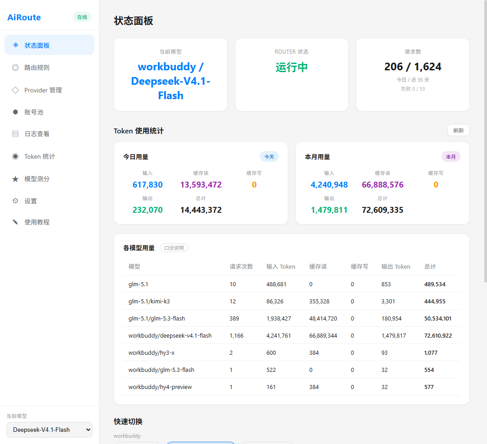
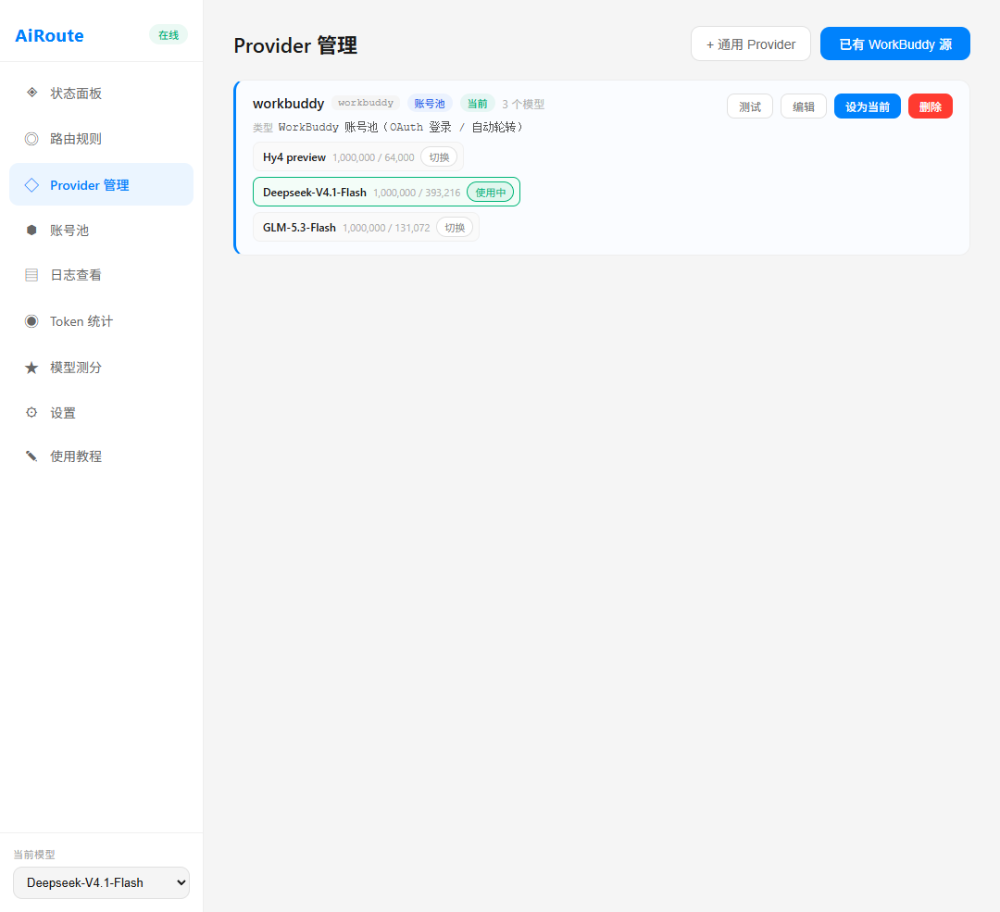

# AiRoute

> 本地 LLM 统一网关 — **一处配置，处处通用，多客户端无缝切换模型**。
> 把所有 AI 客户端统一到 `http://localhost:3000`；把腾讯 WorkBuddy（CodeBuddy）账号变成本地网关，OAuth 登录即用、无需 API Key。

[](https://github.com/c347087870/AiRoute)
[](https://nodejs.org)
[](LICENSE)
[](https://pnpm.io)

---

> **免责声明**：本项目仅供学习和研究使用。使用者需遵守 WorkBuddy 服务条款，自行承担使用风险（包括账号封禁、条款违约等）。作者不对任何因使用本项目产生的直接或间接损失负责。

> **打赏支持**：如果 AiRoute 帮到了你，欢迎打赏一下，支持作者持续维护。
>
> 

---

## 界面预览

**状态面板**（当前模型、请求统计、Token 用量、模型芯片快速切换）



**Provider 管理**（增删改查、连通性测试、单模型切换）



---

## 核心亮点

| 亮点 | 说明 |
|---|---|
| **一处配置，处处通用** | Provider、API Key、路由规则只在 AiRoute 里配置一次；本机所有客户端（Claude Code、Cursor、各类 SDK、脚本）统一直连 `http://localhost:3000`，局域网设备也能用，不再在每个软件里重复填 Key、换地址 |
| **统一入口** | 同时兼容 Anthropic 与 OpenAI 两套协议，`/v1/messages`、`/v1/chat/completions`、`/v1/responses` 共用一个端口；客户端完全不需要知道真实的上游地址 |
| **一键切换，多客户端无缝** | 侧边栏 / 状态面板 / 系统托盘 / Provider 页四处切换入口实时同步；切换对所有已接入客户端**立即生效**——Claude Code 里正跑着的会话，下一条请求就是新模型，无需改配置、无需重启任何客户端 |
| **智能路由** | Auto 模式按请求内容自动挑模型：12 种内置检测条件 + 默认兜底 + 自定义匹配规则，命中即路由；贵的模型做难事，便宜的做杂事 |
| **故障自愈** | 主模型失败自动 Fallback 到备用模型；WorkBuddy 账号池内失败自动换号，全程对客户端透明 |
| **WorkBuddy 账号池** | 把腾讯 WorkBuddy（CodeBuddy）账号变成本地网关：OAuth 登录即用，多号轮转共享额度、积分快过期优先消耗、签到/保活/成长任务全自动 |
| **可视化操作** | Electron 桌面客户端，Provider、路由规则、Fallback、账号池、日志与统计全部界面完成，无需手改配置文件 |
| **开箱即用** | 打包为单个 `AiRoute.exe`，内置服务，双击即用；支持局域网访问、开机自启与托盘常驻 |

---

## 架构

```
┌─────────────────────────────────────────────────────────────┐
│   Claude Code · Cursor · 各类 OpenAI / Anthropic 兼容客户端   │
│   本机 http://localhost:3000 · 局域网 http://<本机IP>:3000    │
└───────────────────────────┬─────────────────────────────────┘
                            ▼
┌─────────────────────────────────────────────────────────────┐
│                       AiRoute (:3000)                       │
│    请求代理 · 模型切换 · 智能路由 · Fallback · 日志与统计      │
└──────┬──────────┬──────────┬───────────┬────────────────────┘
       ▼          ▼          ▼           ▼
   ┌──────┐  ┌──────┐  ┌────────┐  ┌──────────────────────────┐
   │ GLM  │  │ 小米 │  │ Claude │  │ WorkBuddy 账号池          │
   └──────┘  └──────┘  └────────┘  │ 多号轮转 · 失败换号 ·     │
                                   │ 积分核算 · 任务自动化      │
                                   └──────────────────────────┘
```

---

## 快速开始

### 方式一：下载即用（推荐）

到 [Releases](https://github.com/c347087870/AiRoute/releases) 下载最新的 `AiRoute.exe`，双击运行，无需安装任何依赖。

首次启动后：

1. 打开「Provider 管理」添加模型来源（上游地址 + API Key）；或直接添加 WorkBuddy 账号池（无需任何 Key，见下文）
2. 打开「状态面板」，点击模型芯片切换当前模型
3. 把任意客户端指向 `http://localhost:3000`（见「统一入口」一节）

> **更新**：AiRoute 启动后会静默检查 GitHub Releases，有新版本时侧边栏会弹出提示，可直接在应用内下载新版 exe（下载完成后打开所在文件夹）；也可以随时在「设置 → 关于与更新」手动检查。

### 方式二：源码运行

前置条件：[Node.js](https://nodejs.org) >= 18、[pnpm](https://pnpm.io) >= 10

```bash
git clone https://github.com/c347087870/AiRoute.git
cd AiRoute
pnpm install

# Electron 桌面应用（网关服务 + 前端 + 窗口）
pnpm dev

# 只启动网关服务 + 前端页面（浏览器打开 http://localhost:5173 调试，不启动 Electron）
pnpm dev:web

# 或只启动网关服务（配合任意客户端使用）
node server/router.js
```

服务默认监听 `http://localhost:3000`，端口可在「设置」页修改（保存后点「重启 Server」生效）。

> `server/models.json` 存放 Provider 配置（含 API Key），已加入 `.gitignore` 不会提交；推荐直接在客户端「Provider 管理」页面配置，无需手改文件。

---

## 统一入口：一处配置，处处通用

AiRoute 启动后就是一个标准的本地 LLM 网关：**你不必再在每个客户端里配置上游账号**——Provider、Key、路由规则全部集中在 AiRoute，客户端只需要认一个地址。

| 项目 | 值 |
|---|---|
| 本机接入地址 | `http://localhost:3000` |
| 局域网接入地址 | `http://<本机IP>:3000`（手机 / 另一台电脑 / 虚拟机同样适用） |
| API Key | `sk-airoute`（任意非空字符串；AiRoute 本地不做鉴权） |
| Anthropic 协议 | `/v1/messages`、`/v1/messages/count_tokens`（Claude Code 等自动拼接） |
| OpenAI 协议 | `/v1/chat/completions`、`/v1/responses`、`/v1/models` |

> 切换模型时**所有客户端同步生效**：AiRoute 只转发「当前激活模型」，客户端里填的模型名仅是占位，实际走哪个模型始终由 AiRoute 决定。

### 接入 Claude Code

配置文件位于 `~/.claude/settings.json`（Windows：`C:\Users\<用户名>\.claude\settings.json`）：

```json
{
  "env": {
    "ANTHROPIC_AUTH_TOKEN": "sk-airoute",
    "ANTHROPIC_BASE_URL": "http://localhost:3000"
  },
  "model": "claude-opus-4-7"
}
```

> **⚠️ 关键**：`ANTHROPIC_BASE_URL` 只写到端口号，**不要**带 `/v1/messages` 等路径——Claude Code 会自动拼接，写全路径会变成 `/v1/messages/v1/messages` 导致 404。
> 修改后需**完全退出并重启** Claude Code 才生效。

`model` 字段可填真实模型 ID（`/v1/models` 会返回你配置的全部模型），也可填兼容别名：

```
claude-opus-4-0-20250514    claude-opus-4-20250514
claude-sonnet-4-0-20250514  claude-sonnet-4-20250514
claude-3-7-sonnet-20250219  claude-3-5-sonnet-20241022
claude-3-5-haiku-20241022   claude-3-opus-20240229
gpt-4o                      gpt-4o-mini
gpt-4-turbo                 gpt-3.5-turbo
```

无论填哪个，实际调用的都是 AiRoute 当前激活的模型。

### 接入 OpenAI 兼容客户端

任何支持自定义 Base URL 的 OpenAI 兼容客户端（Cursor、Continue、各类 SDK 与命令行工具）：

```
Base URL: http://localhost:3000/v1
API Key:  sk-airoute
Model:    任意（或填 /v1/models 拉到的真实模型 ID）
```

### 局域网内其他设备

把地址换成运行 AiRoute 电脑的局域网 IP 即可（如 `http://192.168.1.10:3000`），手机、平板、另一台电脑共享同一套模型池与切换能力。

---

## 模型路由（重点）

### Provider 与多模型

一个 Provider = 一套上游账号（地址 + Key + 多个模型）。每个模型可单独设置最大上下文 / 最大输出 / 推理档位，在「Provider 管理」页面可视化编辑并支持连通性测试：

```json
{
  "my-provider": {
    "baseURL": "https://your-api.com/anthropic",
    "openaiURL": "https://your-api.com/v1",
    "apiKey": "your-api-key",
    "displayName": "我的 Provider",
    "models": [
      { "id": "model-large", "displayName": "大杯", "maxContext": 200000, "maxOutput": 8192 },
      { "id": "model-small", "displayName": "小杯" }
    ]
  }
}
```

> - `baseURL` 走 Anthropic 协议、`openaiURL` 走 OpenAI 协议，二者至少填一个；请求按客户端协议**直接走对应端点，不做格式转换**，最大化保留各协议原生能力
> - `maxOutput` 会在请求未指定时自动注入（Anthropic 协议必填字段）；数组第一个模型是该 Provider 的默认模型
> - API Key 支持密码 / 明文切换与复制；老配置里的单 `"model"` 字段自动兼容，不改写你的文件

### 模型引用

切换与路由的最小单位是**模型**，引用格式 `Provider名/模型ID`：

```
my-provider/model-large     my-provider/model-small     workbuddy/模型ID     auto
```

侧边栏下拉、状态面板、托盘菜单、路由规则目标、兜底模型全部使用该格式。

### 智能路由（auto 模式）

把当前模型设为 `auto`，AiRoute 会**按请求内容自动挑选模型**，贵的模型做难事、便宜的做杂事。内置 12 种检测条件 + 1 条默认兜底，共 13 条规则：

| # | 条件 | # | 条件 |
|---|---|---|---|
| 1 | 包含代码 | 7 | 数学计算 |
| 2 | 包含 SQL | 8 | 文本摘要 |
| 3 | 中文任务 | 9 | 翻译任务 |
| 4 | 英语请求 | 10 | 代码审查/优化 |
| 5 | 知识问答 | 11 | 编写测试 |
| 6 | 创意写作 | 12 | 长上下文 |
| | | 13 | 默认（全局唯一兜底规则） |

- **自定义匹配规则**（最高优先级，页面独立区块）：当请求包含指定字符串时直接路由到目标模型——只匹配本次输入的**最后一条用户消息**，不受对话历史影响；例如 `123` → A 模型、`456` → B 模型，输入里出现哪个就走哪个
- **未命中兜底**：所有检测条件都未命中时走「默认」规则的目标；未配置默认规则则兜底到第一个可用 Provider，不会报错
- 所有规则在「路由规则」页面可视化编辑（智能路由规则 + 自定义匹配规则两个区块），即改即生效

### Fallback 故障自愈

主模型请求失败时自动切换备用模型，对客户端**完全透明**（客户端无感知，不需要重试）；Fallback 链在「路由规则」页面配置，所有 fallback 事件写入日志可追溯。

### 一键切换模型（四处同步）

| 入口 | 位置 |
|---|---|
| 侧边栏下拉框 | 左下角「当前模型」，全页面可见 |
| 状态面板芯片 | Dashboard 顶部模型卡片，点击即切 |
| 系统托盘 | 右键菜单按 Provider 分组的二级菜单，常驻可切 |
| Provider 管理 | 每个模型行的「切换」按钮 |

四处实时同步、指向同一个激活项；切换瞬间所有已接入客户端（Claude Code 正在跑的会话、正在请求的脚本等）**下一条请求即用新模型**。

### 推理档位

在 Provider 管理的模型列表中**逐模型配置**（默认 / low / high / max / xhigh / 自定义）：配置后强制覆盖客户端请求中的 `reasoning_effort`，避免非标档位被 OpenAI 协议上游拒绝；选「默认」则不干预客户端原值。

---

## WorkBuddy 账号池（重点）

**把腾讯 WorkBuddy（CodeBuddy）账号变成本地网关**：不需要 API Key、不需要单独申请额度——用 OAuth 登录你的 WorkBuddy 账号，账号池会作为内置 Provider 出现在 AiRoute 中，与其他模型完全同权：一键切换、参与智能路由、可加入 Fallback 链。

```
任意客户端 ──► AiRoute (:3000) ──► WorkBuddy 账号池 ──► 腾讯上游
             统一入口 / 路由       多号轮转 · 积分核算      WorkBuddy 账号
```

### 核心机制

- **多号轮转**：请求自动调度到当前最合适的可用账号，多账号共享调度、互相分担
- **会话粘性**：同一会话（30 分钟窗口）固定使用同一账号，避免上下文漂移
- **失败自动换号**：请求失败自动切换到下一个可用账号重试，对客户端完全透明
- **智能容错**：429 软冷却（指数退避）、余额不足自动休眠到次日凌晨、连续失败熔断保护、模型级不可用负缓存（自动跳过不支持的模型）——坏账号自动让路，好账号优先干活
- **积分精算**：快过期积分优先消耗（168 小时窗口内优先）、闲置账号补偿加权，最大化每份额度利用率
- **内置提示词系统**：出站前按模式替换 / 追加网关自有 system 提示词，并进行指纹脱敏处理，规范请求形态、提高上游兼容性

### 接入步骤

1. **添加账号**：在「账号池」页面点「+ 添加账号」，浏览器完成 OAuth 授权；支持添加多个账号，页面每 3 秒自动检测授权结果。凭证仅保存在本地 `server/workbuddy-auths/`，不会上传到任何服务器
2. **启用模型**：「模型和档位」页签点「拉取上游模型」，勾选需要的模型并保存；启用后即刻出现在所有模型选择入口，引用格式 `workbuddy/模型ID`
3. **开始使用**：把当前模型切到某个 `workbuddy/xxx`，或把它加入智能路由 / 兜底链即可；客户端侧无需任何额外配置

### 账号池页面（8 个页签）

| 页签 | 功能 |
|---|---|
| 账号池 | 添加 / 移除账号、逐个签到、刷新余额、启用 / 禁用、详情面板（冷却类型与剩余、熔断状态、在途请求数、快过期积分、模型受限明细） |
| 积分构成 | 按账号查看积分批次：剩余 / 已用 / 总额、到期时间、周期包，一眼看清哪笔积分快过期 |
| 用量 | 按「账号」与「模型 × 倍率」两个维度统计请求数 / 失败数、输入 / 输出 / 总 Token、平均延迟、平均输出速度、积分扣除与「平均积分每 1M」；今天 / 昨天 / 72 小时 / 7 天 / 30 天 / 全部多窗口切换，工具栏显示「昨天」全天合计，支持「立即落盘」 |
| 模型和档位 | 拉取上游模型、勾选启用、查看各模型与档位配置 |
| 成长任务 | 接受任务、一键完成全部、全账号扫描未完成任务、入队执行与领奖 |
| 定时任务 | 签到 / 旅行 / 活跃 / 保活 / 夜猫子 / 成长任务 / 余额刷新 逐项启用与时点配置，支持「立即执行」与「保存排程」 |
| 高级配置 | 提示词模式、改写档位（compat 修补 / native 保真直通）、使用端身份（WorkBuddy 桌面端 / CodeBuddy IDE）、指纹脱敏、设备令牌文件可编辑并保存；账号池参数（冷却 / 熔断 / 在途上限等）只读展示 |
| 运行日志 | 按频道（对话 / 任务 / 系统）与关键词过滤，3 秒自动刷新 |

### 自动化任务

由内置调度器按你配置的时点自动执行：**每日签到 + 余额查询**（默认 9:00 / 21:00 双时点）、**猫猫旅行**、**活跃上报**、**token 保活**、**夜猫子**、**成长任务扫描执行**——账号维护与积分增长全自动，无需手动干预。

### 安全与合规

- 凭证仅存本地数据目录，**不会随 exe 打包分发**（发布构建已排除），日志中敏感字段自动脱敏
- 账号池功能仅供个人自用，请遵守腾讯相关服务条款；使用自动化功能可能存在的账号风险由使用者自行承担

---

## 其他功能

| 功能 | 说明 |
|---|---|
| 状态面板 | 当前模型、请求统计、Token 用量（含缓存）、最近请求、模型芯片快速切换 |
| 日志 | 记录模型 / 耗时 / 状态码 / Token / 积分消耗 / 重试与 fallback 详情，「重试 / 降级」条目单独标记并可筛选；同一任务的多轮调用合并为一条记录；按天存储，支持按模型 / 状态 / 关键词筛选与清空；页尾附「积分历史」余额变动流水（正为获取、负为消耗，支持按账号筛选与翻页） |
| Token 统计 | 输入 / 缓存读 / 缓存写 / 输出 四维分开计数（缓存不与输入重复计算），今天 / 近三天 / 近七天 / 近半个月 / 近一个月 五档周期；「今天」按小时、其余按天展示趋势，附按模型统计 |
| 模型测分 | 内置 40 题 × 9 维度题库，多模型横向跑分；客观题规则判定 + 主观题裁判评分，题库可编辑、导入导出 |
| 使用教程 | 内置图文教程（接入指南 / 核心概念 / 功能详解 / 常见问题），侧边栏「使用教程」入口 |
| 更新检查 | 启动静默检查 GitHub Releases，发现新版本时侧边栏提示，应用内下载新版 exe；「设置 → 关于与更新」支持手动检查 |
| 系统设置 | 端口配置、重启 Server、开机自启、系统状态（版本 / 端口 / 内存占用 / 日志缓存清理） |
| 托盘常驻 | 右键按 Provider 分组快速切换模型（含 Auto）、打开面板、退出；双击托盘图标显示主窗口 |

---

## 常见问题

<details>
<summary><b>修改了 Claude Code 配置但不生效？</b></summary>

需要**完全退出并重新启动** Claude Code（包括后台进程），配置只在启动时读取一次。
</details>

<details>
<summary><b>客户端报 404 错误？</b></summary>

`ANTHROPIC_BASE_URL` / `Base URL` 只写到端口号：`http://localhost:3000`，**不要**再拼 `/v1/messages` 或 `/v1`（OpenAI 兼容客户端需写 `/v1` 的除外，见上文示例）。路径重复拼接会导致 404。
</details>

<details>
<summary><b>Claude Code 的 <code>/model</code> 列表不对？</b></summary>

检查三点：① `ANTHROPIC_BASE_URL` 未包含路径；② 已重启 Claude Code；③ 已在 AiRoute 中配置好 Provider 和模型。列表由 AiRoute 的 `/v1/models` 实时提供。
</details>

<details>
<summary><b>auto 模式没有配置任何规则会怎样？</b></summary>

未命中任何条件时会走「默认」规则的目标；若未配置默认规则，则兜底到第一个可用 Provider，不会报错。建议在「路由规则」页配置好各条件的映射。
</details>

<details>
<summary><b>如何添加 Provider？</b></summary>

打开「Provider 管理」页面，点击「添加 Provider」，填写名称、上游地址（Anthropic / OpenAI 至少一个）与 API Key，再为它添加模型即可。所有配置保存在本地 `server/models.json`（已加入 `.gitignore`，不会被提交）。
</details>

<details>
<summary><b>API Key 会泄露吗？</b></summary>

Key 只存储在本地 `server/models.json`，该文件被 `.gitignore` 排除且打包时会剔除，不会出现在发布产物中；日志中相关字段也会自动脱敏。
</details>

<details>
<summary><b>局域网内其他设备连不上？</b></summary>

确认：① 客户端填写的是 AiRoute 所在电脑的局域网 IP（如 `192.168.1.10`）而不是 `localhost`；② 端口与 AiRoute 设置一致；③ Windows 防火墙已允许 AiRoute 通过（专用网络）。
</details>

<details>
<summary><b>账号池显示「无可用账号」？</b></summary>

在「账号池 → 详情」中查看具体原因：常见的是账号处于冷却或熔断保护期、余额不足已休眠到次日、或该模型被账号标记为不可用。多数情况等待保护期结束会自动恢复；持续异常可到「运行日志」按频道和关键词排查。
</details>

---

## 开发与打包

```bash
pnpm dev        # 开发模式（Electron 应用）
pnpm dev:web    # 只启动服务与前端（浏览器访问 http://localhost:5173，不启动 Electron）
pnpm build      # 打包便携版单文件 exe（app/dist-electron/AiRoute.exe）
pnpm test       # WorkBuddy 模块离线测试
```

> 打包脚本会自动排除 API Key（`models.json`）、WorkBuddy 凭证与个人运行数据，产物可放心分发。
> 国内网络安装依赖较慢时，可改用镜像：`pnpm config set registry https://registry.npmmirror.com`

---

## 使用声明

- 本项目完全开源免费，仅供个人学习与技术研究使用；严禁任何形式的倒卖、加价转售或商业化包装分发
- 请在遵守各上游平台服务条款的前提下使用本项目；使用 WorkBuddy 账号池等自动化能力可能带来的账号风险由使用者自行承担
- 项目不对账号封禁、额度损失或数据丢失承担任何责任

---

## 许可

[MIT License](LICENSE)


